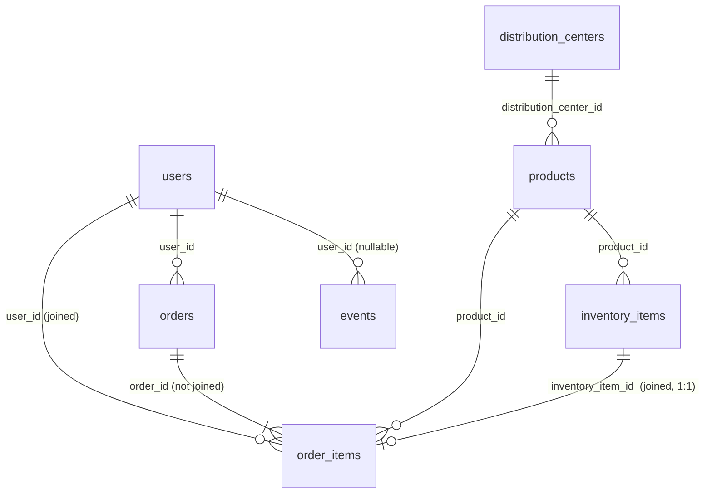

# Peek — Product & BI Analyst Data Challenge

Federico Lira · September 2026
Dataset: `bigquery-public-data.thelook_ecommerce` · BigQuery Standard SQL
Outputs in this repo are as of **2026-09-24 UTC** (`data/_as_of.csv`).

---

## Where to find each deliverable

| the brief asks for | where it is |
|---|---|
| Runnable SQL for all of Part 1 | [`sql/part1_queries.sql`](sql/part1_queries.sql) — Tasks A–D, the cohort stretch, and 4 QA checks. Each statement runs on its own. |
| Slides (Part 2) | [`analysis/deck.pdf`](analysis/deck.pdf) — 7 slides + 5 appendix. PNG per slide in [`analysis/slides/`](analysis/slides/). |
| Assumptions & definitions (churn, active, funnel stages, cohorts) | [§ Definitions](#definitions) · [§ Funnels](#funnels--stage-definitions) |
| Date ranges used & why | [§ Date ranges](#date-ranges-and-why) |
| How to run queries | [§ How to run](#how-to-run) |
| Churn limitation + refinement (Task C) | [§ Limitations of the 90-day churn](#limitations-of-the-90-day-churn-definition) |
| Task D assumptions & data needed | [§ Task D](#task-d--free-shipping-over-100) |
| Questions to address | [§ Answers](#answers-to-the-questions-to-address) — all four |
| Optional stretches completed | cohort retention heatmap, LTV curve, churn by traffic source (slides 4–5) |
| Part 3 — AI | [§ Part 3](#part-3--how-i-used-ai-on-this-challenge) |

---

## TL;DR — the one thing leadership should know

**Monthly revenue has more than doubled in a year, and 84% of it comes from first-time
buyers. Repeat purchase is rare *and* slow, so growth depends almost entirely on
acquisition.**

| evidence | number |
|---|---|
| Revenue, Aug 2026 vs Aug 2025 | **$115K, +111%** (orders +129%; average order value $87 → $80) |
| Share of revenue from first-time buyers, last 12 months | **84%** |
| First-time buyers who buy again within a year | **16.2% — about 1 in 6** |
| … within 90 days / ever | 4.4% / 35.7% |
| Median time from 1st to 2nd purchase, among those who return | **412 days** |
| First order as a share of 24-month customer value | **89%** ($85 of $95) |
| First-time buyers arriving through Search | **70%** |

Revenue is a near-direct function of acquisition volume, concentrated in one channel. If
acquisition cost rises or Search saturates, there is little repeat revenue underneath:
a 10% drop in new customers would take roughly 8% off revenue.

The opportunity is concrete: **returning customers already spend 12% more per head** than
new ones ($89 vs $80). The business is not failing to monetize repeat customers — it
produces few of them, and late.

**One caveat for every trend in this repo.** theLook places each order at a random date
between the customer's signup and today, so calendar trends rise into the present partly by
construction. Comparisons across segments in the same period are unaffected. Evidence in
[§ Funnels](#why-every-calendar-trend-here-rises-into-the-present).

---

## Date ranges, and why

**Analysis window: January 2019 – August 2026.** Both ends are derived in SQL, in a
`params` CTE at the top of each query — never hard-coded.

The dataset does not simply end, and two separate things go wrong at the boundary. QA.1
measures both:

| | run on 2026-09-23 | run on 2026-09-24 (UTC) |
|---|---|---|
| first order date | 2019-01-10 | 2019-01-10 |
| last order date | 2026-09-27 | 2026-09-27 — *in the future* |
| partial month | 2026-09 | 2026-09 |
| rows dated after today | 1,154 | 632 |

1. **September 2026 is partial.** Reporting it beside complete months manufactures a
   collapse. Guard: exclude the current month.
2. **Hundreds of rows are dated after today.** The generator writes ahead of time; the count
   shrinks every day as today catches up, which is itself the proof. Guard: cap every
   window at `LEAST(DATE(MAX(created_at)), CURRENT_DATE())`.

The second guard matters most because it survives the first: a future-dated row can sit
inside a month that is otherwise complete, where "drop the last month" never sees it.

**Reproducibility note.** `CURRENT_DATE()` is evaluated in UTC, so outputs depend on the
day they are produced. [`run_all.py`](run_all.py) regenerates every output in one pass and
records the date in `data/_as_of.csv`; to reproduce a past snapshot exactly, replace
`CURRENT_DATE()` in the `params` CTEs with that date. The underlying rows did not change
between runs: Task A is identical row for row across days.

---

## Definitions

Per the brief, restated so every number is auditable.

| term | definition used |
|---|---|
| Completed sale | `order_items.status = 'Complete' AND returned_at IS NULL` |
| Revenue | `SUM(order_items.sale_price)` of completed line items |
| COGS · Gross profit | `SUM(inventory_items.cost)` over the same items · Revenue − COGS |
| Month | `DATE_TRUNC(DATE(order_items.created_at), MONTH)` |
| Order · AOV | `COUNT(DISTINCT order_id)` · revenue ÷ orders |
| Active customer | ≥1 completed order in the month |
| New customer | first-ever completed order falls in that month |
| Returning customer | active in the month, first completed order in an earlier month |
| Cohort | customers grouped by the month of their first completed order |
| 90-day churn | active in month M, no completed order in the 90 days after M ends |
| Funnel stages | signed up → placed an order → activated (first completed order) → second order — [§ Funnels](#funnels--stage-definitions) |
| Shipping zone | domestic if `users.country = 'United States'`, else international |
| Parcels per order | distinct distribution centres among the order's items |

### Grain — the decision everything else rests on

`order_items` is **one row per line item, not per order.** Revenue and units aggregate at
that grain; orders and customers need `DISTINCT`. `inventory_items` joins 1:1 on
`inventory_item_id` — QA.2 proves it (45,373 rows before and after). `users` would fan
out if joined before aggregating, so Task D rolls line items up to one row per order first.

### Data model — which key joins what



| table | rows | one row is | used for |
|---|---|---|---|
| `order_items` | 181,415 | a line item — **the fact table** | revenue, units, status, dates, customer |
| `inventory_items` | 489,904 | a stock unit (181,415 sold) | cost → COGS; distribution centre → parcels |
| `users` | 100,000 | a person (20,034 never ordered) | traffic_source, country, signup date |
| `orders` | 125,176 | an order | not needed — see below |
| `products` | 29,120 | a product | not needed for these KPIs |
| `events` | 2,424,864 | a web event (46% anonymous) | tested, not usable — [§ Funnels](#funnels--stage-definitions) |
| `distribution_centers` | 10 | a warehouse — all in the US | shipping geography only |

Every relationship was checked, not assumed: 0 line items without an order, a user, a
product or a stock unit; `inventory_item_id` is unique in `order_items`; and `order_items`
carries **the same `user_id` and `status` as its parent order in every row** — which is why
`orders` is never joined. A join that adds no columns can only add risk.

### What the 'Complete' filter costs — measured, not assumed

| status | line items | revenue |
|---|---|---|
| Shipped | 54,731 | $3,282,437 |
| **Complete** | **45,373** | **$2,702,312** |
| Processing | 36,028 | $2,153,356 |
| Cancelled | 27,154 | $1,618,599 |
| Returned | 18,129 | $1,071,383 |

The brief's definition keeps **25% of line items**, and `Shipped` alone carries *more*
revenue than `Complete`. I use the brief's definition throughout; every revenue figure here
is therefore a quarter of gross merchandise flow. In a real setting I would report both and
let finance fix the revenue-recognition point. (The statuses are mutually exclusive and only
`Returned` has a `returned_at`, so `AND returned_at IS NULL` adds nothing *in this dataset* —
kept for fidelity to the brief.)

---

## Part 1 at a glance

| task | output | headline |
|---|---|---|
| A — Monthly financials | one row per month, Jan 2019 – Aug 2026 | Aug 2026 revenue $115,301, +111% YoY; AOV flat |
| B — New vs returning | one row per month | 84% of last-12-month revenue from new customers; `new + returning = active` every month (QA.4) |
| C — 90-day churn | one row per month + `measurable` flag | 94.2% (last 12 measurable months); last measurable month May 2026 |
| C stretch — cohort heatmap | cohort × months-since-first | month-1 repeat ~3%, ~1% after |
| D — Free shipping (hypothetical) | D.1 DiD · D.2 monthly · D.3 shipping zone · D.4 simulation · D.5 break-even | simulated: orders ≥$100 +3.7 pts, gross profit after shipping −26% |

---

## Limitations of the 90-day churn definition

Three, in order of how much they move the number.

### 1. Repeat purchase is slower than the window

`sql/analysis/g_repeat_timing.sql` follows 42,553 customers whose first order is at least
a year old:

| buy again … | share |
|---|---|
| within 90 days | 4.4% |
| within 365 days | 16.2% |
| ever | 35.7% |
| median gap, 1st → 2nd purchase (among repeaters) | 412 days |

But the window explains less than it seems. On the same months (Sep 2024 – Aug 2025), a
365-day window gives **89.7%** churn against **95.8%** at 90 days
(`sql/analysis/m_churn_365d.sql`). **Repeat is rare, not just slow** — the 90-day figure
overstates churn by about six points, not by a multiple.

### 2. 'Complete' is a random 25% sample of orders

The status mix is flat across order years — ~25% Complete, ~30% Shipped, ~20% Processing,
even for 2019 orders (`sql/analysis/i_status_by_year.sql`). Status is assigned at random;
it does not progress. A genuine repeat order counts only if it happens to be labelled
'Complete'. Same months, two definitions (`sql/analysis/h_churn_definition_sensitivity.sql`):

| "purchase" means | 90-day churn, Jun 2025 – May 2026 |
|---|---|
| `status = 'Complete'` and not returned (brief) | 94.1% |
| any order not Cancelled and not Returned | 88.5% |

### 3. The three most recent months cannot be measured

Churn for month M cannot be observed until 90 days after M ends. Computing it anyway does
not fail — it returns a confident wrong answer. August 2026 reports **100.0% churn** on
1,415 active customers: the edge of the dataset, not an event. Task C emits a `measurable`
flag instead of leaving the trap in the output. **89 of 92 months are measurable.**

### How I would refine it in a real product setting

1. **Size the window from the data.** Report churn on 12 months, and keep the 90-day number
   as a leading indicator rather than calling it churn.
2. **Define "purchase" with finance** and publish the sensitivity to that choice beside the metric.
3. **Model churn as a probability** (survival analysis), so recent cohorts contribute
   censored observations instead of being dropped — recovering exactly the three months a
   fixed window discards.

---

## Funnels — stage definitions

### Why there is no session funnel

The brief allows `events` for funnels (product → cart → purchase). I built it, tested it,
and **do not use it** (`sql/analysis/j_events_funnel.sql`):

- every **identified** session follows one of four fixed paths and **always** ends in a
  purchase — 181,415 sessions, exactly one per `order_items` row;
- every **anonymous** session follows one of four abandonment paths and **never** buys —
  a flat ~65,000 a year.

Session "conversion" is therefore (order volume) ÷ (order volume + a constant), and it rises
on its own: 2.4% in 2019 to 39.9% in 2025. Reporting that as improved conversion would be
the most confident wrong answer available in this dataset.

### Why every calendar trend here rises into the present

For every customer with exactly one order, where does it fall between signup and today?
Every decile holds **9.8–10.2%** of 42,303 customers — uniform
(`sql/analysis/k_order_placement_test.sql`). theLook creates users at ~12,600 a year and
places each order at a random date between signup and today. So recent months always
receive orders from every user created so far. The real-world discipline this points to is
comparing cohorts of equal age rather than calendar months — which is what the cohort
heatmap and LTV curve do.

### The funnel this data does support — user level

`sql/analysis/l_lifecycle_funnel.sql`, accounts at least a year old, each stage a strict
subset of the one before:

| stage | definition | users | of signups |
|---|---|---|---|
| 1. Signed up | `users.created_at` | 85,017 | 100% |
| 2. Ordered | any order, any status | 67,970 | 80% |
| 3. Activated | first completed order (the brief's definition) | 23,342 | 27% |
| 4. Repeat | activated **and** a second valid order | 10,407 | 12% |

Every stage is identical across the five acquisition channels, to within about a point.
Nothing in this data distinguishes where a good customer comes from.

---

## Task D — free shipping over $100

The policy is hypothetical: there is no shipping fee, no flag, no treatment in the data.
The SQL lays out how I would evaluate it, then — as the brief asks — simulates a
noticeable impact.

**D.1 — the design: difference-in-differences.** A pre/post comparison alone misleads here:
the business grows every month, so any before/after window shows a lift. Orders ≥$100
(eligible) against orders <$100 (control), ±90 days around 2022-01-15, removes what moved
both groups together. On the real data the treated group grew +26% vs +5% for control — but
with 121 and 152 orders the difference is not significant (p ≈ 0.22). With ~500 orders a
quarter, only a shift of ≥8 points in the share of orders over $100 is detectable at 80%
power. The design is right; the sample is not.

**D.3 — the segment: shipping zone.** Every acquisition channel behaves identically, so a
channel cut cannot show anything. The cost of free shipping lives in where orders ship
(`sql/analysis/o_shipping_geography.sql`):

- all 10 distribution centres are in the US, yet **77% of revenue ships abroad** (China
  alone ~34%);
- **60% of orders ≥$100 are split shipments** — 1.9 parcels on average, vs 1.2 below $100.

**D.4 — the simulated impact.** The effect is injected through the mechanism thresholds
actually trigger: after launch, 30% of $70–$99 orders top up to $100–$120. Draws use
`FARM_FINGERPRINT(order_id)`, so the simulation reproduces exactly.

| 12 months after launch | actual | simulated |
|---|---|---|
| share of orders ≥ $100 | 27.8% | 31.5% |
| revenue | — | +1.1% |
| gross profit after the shipping the policy absorbs | — | **−26%** |

**D.5 — break-even.** The policy stops losing money only if a parcel costs **under $1**
($0.95 domestic, $0.82 international), because **~91% of the parcels it pays for go to
orders that were already over $100.** The incentive mostly subsidizes behaviour that
already existed.

**Assumptions** (all parameters in the SQL): customers pay shipping today; a parcel costs
$8 domestic / $25 international; 30% of near-threshold orders top up; the added item carries
the order's own margin. **Data needed to do this properly:** shipping fees and parcel costs
per order, a treatment flag or randomized holdout, cart-abandonment events, returns cost,
and a pre-registered minimum detectable effect.

---

## Answers to the questions to address

### 1. Definitions & alternatives

Churn, active, new/returning and cohort are defined in [§ Definitions](#definitions).
The alternatives I would use, and when:

- **Churn → 12-month window**, because the repeat cycle is long; keep 90 days as a leading
  indicator. For a high-frequency product (weekly purchases) the short window is right.
- **Active → trailing-12-month active** instead of active-this-month, for the same reason.
  Monthly active suits subscription or high-frequency products.
- **Returning → "bought in the last 12 months"** when the question is *reactivation* rather
  than acquisition. It does not sum to active, so it cannot replace the cohort-consistent one.
- **Metrics for a product change:** the behaviour the change targets as primary (share of
  orders over the threshold), the business outcome as secondary (revenue, repeat), and
  **gross profit after the cost the change creates** as the guardrail — the metric that
  would have caught the free-shipping loss.

### 2. The most important trend for leadership

**84% of revenue comes from first-time buyers, and only 1 in 6 returns within a year.**
It matters because growth is a direct function of acquisition — 70% of it from Search —
with little repeat base to absorb a slowdown: a 10% fall in new customers takes about 8% off
revenue. The first order is 89% of what a customer spends in two years.

### 3. One business initiative

**Win the second purchase in the first 60 days, and replace "free shipping over $100" with
"free shipping on the second order."**

- **Why:** month 1 is when repeat peaks (3.1% of a cohort vs 0.9% later), and returning
  customers spend 12% more per head. Over-$100 free shipping subsidizes orders that already
  exist; only 4.4% of buyers repeat within 90 days, so a second-order offer pays mostly for
  *new* behaviour.
- **Target:** every first-time buyer, by moment rather than channel (channels behave
  identically) — **US customers first**. Abroad, shipping an order (~1.4 parcels) eats ~78%
  of its gross profit, so use a non-shipping incentive there.
- **Primary metric:** 12-month repeat rate against a 10–20% randomized holdout (today 16.2%).
- **Secondary:** days to second purchase (412), share of revenue from returning customers (16%),
  90-day repeat (4.4%).
- **Guardrail:** gross profit after shipping and incentive cost; unsubscribe rate.
- **Size:** a 3-point lift in 12-month repeat ≈ $25K a year (2.6% of revenue), counting only
  the first repeat order. The shipping offer breaks even at **+1.4 points** of 90-day repeat
  in the US (it would need +15.5 abroad).

### 4. Business-health dashboard (slide A4)

Seven metrics, grouped by the question they answer, plus a data-health strip:

| group | metric |
|---|---|
| Acquisition | new customers / month · share of first-time buyers from Search (concentration) |
| Activation | signup → first order |
| Retention | **12-month repeat rate by cohort (north star)** · share of revenue from returning customers |
| Monetization | trailing-12-month revenue, YoY · gross margin |
| Data health | last complete month · future-dated rows excluded · QA checks passing |

In production: a Looker Studio report on curated BigQuery views, every tile filterable by
cohort, shipping zone and channel.

### Recommendations (slide 6)

1. **Win the second purchase in the first 60 days** — measured against a holdout.
2. **Free shipping on the second order, not over $100** — US first.
3. **Fix measurement before scaling decisions** — agree the revenue-recognition point with
   finance, report churn on 12 months, run the QA checks as scheduled tests, and publish
   curated views for self-service and text-to-SQL.

---

## How the SQL meets the four criteria

**Readable.** One CTE per step, each named for what it holds (`completed_items`,
`first_purchase`, `customer_month`, `with_next`). Comments explain *why* — the grain, the
guards, the choice of window — not what the SQL already says.

**Correct.** Every join is checked for row counts (QA.2); `new + returning = active` is
asserted every month (QA.4 returns zero rows); revenue reconciles to the status breakdown
(QA.3); boundary artefacts are flagged rather than reported (`measurable`). Rewrites were
verified row for row against the version they replaced.

**Performance-aware.** BigQuery is columnar, so each query reads only the columns it needs
(no `SELECT *`) and filters before joining. Task C originally joined each customer-month
back to all of that customer's orders on a date range; the rewrite answers the same question
with a single `LEAD()` over the customer's months — **identical output on all 92 months, at
145 slot-ms instead of 11,152 (77× less compute)**. The full Part 1 file scans about 140 MB
uncached; no single query reads more than ~23 MB.

**Reproducible.** Date windows are derived from the data, not typed. The simulation uses
deterministic hashing, not `RAND()`. Percentiles are exact (`PERCENTILE_CONT`), not
approximate — `APPROX_QUANTILES` returned 412 on one run and 410 on the next. `run_all.py`
regenerates every output in one pass on one as-of date, and every number in the deck is
computed from those outputs.

---

## Data quality — nulls and the events table

A column-level audit of all seven tables found **no empty column and no missing data**:
every null is structural.

| column | nulls | why |
|---|---|---|
| `order_items.shipped_at` | 63,182 | exactly Processing + Cancelled items — never shipped |
| `order_items.delivered_at` | 117,913 | exactly Processing + Cancelled + Shipped |
| `order_items.returned_at` | 163,286 | everything except Returned |
| `inventory_items.sold_at` | 308,489 | stock not yet sold |
| `events.user_id` | 1,125,153 (46%) | anonymous sessions |
| `products.brand` / `name` | 24 / 2 | negligible |

None of the columns the metrics use (`sale_price`, `status`, `created_at`, `user_id`,
`cost`) has a single null.

**Can `events.user_id` be backfilled?** No. The only candidate key is the IP address, and
theLook assigns a new random IP to every session — 181,413 distinct IPs across 181,415
identified sessions. Only 23 of ~500,000 anonymous IPs ever appear on an identified session,
and postal codes average 6.4 users each, so any attribution would be invented. It also would
not change a result: anonymous sessions never purchase, and no Part 1 metric uses `events`.

---

## Part 3 — How I used AI on this challenge

I used Claude Code as a pair, not as an oracle.

- **Reconnaissance first.** Before any analysis, it profiled the seven tables, every join
  key and every null. That is where the future-dated rows, the 25%-Complete finding and the
  template-generated events table came from — none of them is in the brief.
- **Drafting, then arguing.** It drafted the CTE-structured SQL; the cohort-consistent
  new/returning definition, the `measurable` flag and the `LEAD()` rewrite of Task C came out
  of challenging those drafts.
- **Reproducible output.** `analysis/build_deck.py` computes every slide figure from the
  query outputs, so a re-run cannot leave a stale number on a slide.

**Where checks overruled the first draft** — real cases from this challenge:

- **The brief itself.** Text extraction from the PDF silently dropped one sentence — the
  instruction to generate the free-shipping visual *as if there were a noticeable impact*.
  Re-reading the complete source recovered it, and Task D was rebuilt around it.
- **A degenerate column.** Task D.2 computed "% of orders over $100" inside each cohort —
  100% or 0% by construction. It ran and looked like a metric; checking distinct values
  caught it.
- **A non-nested funnel.** The first lifecycle funnel let customers reach "second order"
  without passing "activated". Requiring each stage to be a subset of the one before fixed it.
- **A conclusion revised twice.** "Retention is near zero" became "repeat is slow" once the
  412-day gap was measured, and then "repeat is rare *and* slow" once a 365-day window still
  showed ~90% churn.
- **A session funnel showing conversion up 17×** — traced to a constant denominator.

**An example prompt:**

> "The last three months return a churn rate near 100%. Before assuming that is real: what
> in the data boundary could produce that artefact, and write me the check that would
> distinguish an artefact from a genuine churn spike."

I did not ask it to fix the query. I asked for *the check that would tell me which
explanation is true* — an LLM asked to fix something will fix something, whether or not it
was broken.

**How I validate rather than trust:** row counts before and after every join; identity
assertions that return rows only on failure; reconciliation to known totals; rewrites
compared row for row; the same metric under two definitions and two windows; and treating
anything suspiciously clean — a churn of exactly 100.0% — as a bug until proven otherwise.

**What I would automate next:** run the QA queries on a schedule and alert before a
dashboard refreshes; have an LLM draft the weekly KPI narrative with every figure pulled
from SQL, never computed by the model; and point text-to-SQL at curated, documented views
rather than raw tables, so definitions are fixed upstream.

---

## Repo contents

```
sql/
  part1_queries.sql     Part 1 — the deliverable: Tasks A–D, cohort stretch, QA.1–QA.4
  tasks/                Tasks A–D one per file, for running individually
  analysis/             supporting analyses e–o (retention by channel, LTV, repeat timing,
                        churn sensitivity, status by year, events funnel, order-timing test,
                        lifecycle funnel, 365-day churn, second-order economics, geography)
analysis/
  deck.pdf · deck.html  Part 2 slides
  slides/               one PNG per slide
  build_deck.py         regenerates the deck from data/
data/                   every query output as CSV, plus _as_of.csv
run_query.py            runs one .sql file against BigQuery
run_all.py              regenerates every output in data/ in one pass
requirements.txt        matplotlib (deck only; the SQL runners use the standard library)
```

### How to run

```bash
gcloud auth login
gcloud config set project <your-project>
python run_all.py                  # all queries -> data/*.csv, one as-of date
python analysis/build_deck.py      # data/*.csv -> analysis/deck.pdf
```

Or run a single query: `python run_query.py sql/tasks/a_monthly_financials.sql`. Every
statement also runs as-is in the BigQuery console.

The runners mint a short-lived OAuth token through gcloud and call the BigQuery REST API.
**No service-account key is created, stored or committed**; `.gitignore` blocks `*.json`,
`.env` and `service-account*`. A full uncached `run_all.py` scans a few hundred MB — well
inside the free tier.
