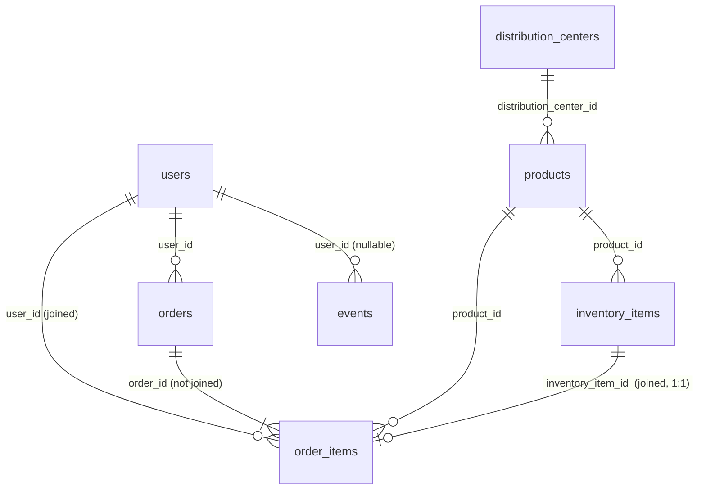

# Peek — Product & BI Analyst Data Challenge

Federico Lira · September 2026
Dataset: `bigquery-public-data.thelook_ecommerce` · BigQuery Standard SQL

---

## TL;DR — the one thing leadership should know

**Monthly revenue more than doubled in a year, and ~84% of it comes from first-time buyers.
Customers do come back — but slowly, so short-term growth depends almost entirely on
acquisition.**

| evidence | number |
|---|---|
| Revenue, Aug 2026 vs Aug 2025 | **$115K, +111%** (orders +129%, AOV flat) |
| Share of revenue from **new** customers, last 12 months | **84%** |
| Customers who ever buy again | **35.8%** |
| …of whom buy again within 90 days | **4.4%** of all customers |
| Median time from 1st to 2nd purchase | **412 days** |
| First order as a share of 24-month customer value | **89%** ($85 of $95) |

The shape matters. Revenue is a near-direct function of acquisition volume, and 70% of
first-time buyers arrive through a single channel (Search). If acquisition cost rises or
that channel saturates, there is little repeat revenue underneath to absorb it.

The upside is cheap to state: **returning customers already spend more per head than new
ones** ($89 vs $80 in Aug 2026, +12%). The business is not failing to monetize repeat
customers; it produces few of them, and late.

**Correction from my own first pass.** I initially read the 94% 90-day churn as "retention
is near zero". Measuring the actual repeat cycle (`sql/analysis/g_repeat_timing.sql`)
showed that is wrong: the 90-day window is ~4.6× shorter than the median repeat gap, so it
labels most eventual repeat customers as churned. The slides and this README use the
corrected reading.

**One caveat to carry through every trend in this repo:** theLook places each order at a
random date between the customer's signup and today, so calendar trends rise into the
present partly by construction. Segment-vs-segment comparisons are unaffected. Evidence and
handling in [§ Funnels](#funnels--stage-definitions-and-why-there-is-no-session-funnel).

**Slides:** [`analysis/deck.pdf`](analysis/deck.pdf) — regenerate with
`python analysis/build_deck.py`.

---

## Date ranges, and why

**Analysis window: 2019-01 through 2026-08.** Both ends are derived in SQL, never
hard-coded — see any `params` CTE.

The dataset does not simply "end", and two separate things go wrong at the boundary. QA.1
measures both:

```
first_date         2019-01-10
last_date          2026-09-27   <- four days in the future
max_observable     2026-09-23
partial_month      2026-09-01
future_dated_rows  1,154
```

1. **September 2026 is partial.** Reporting it beside complete months manufactures a
   collapse. Guard: exclude the current month.
2. **1,154 rows are dated later than today.** theLook is continuously generated, and the
   generator emits forward-dated rows. Nobody bought anything next Friday. Guard: cap every
   window at `LEAST(DATE(MAX(created_at)), CURRENT_DATE())`.

The second guard is the one that matters, because it survives the first: a future-dated row
can sit inside a month that is otherwise complete, where a "drop the last month" rule never
sees it.

---

## Definitions

Per the brief, restated here so every number is auditable.

| term | definition used |
|---|---|
| Completed sale | `order_items.status = 'Complete' AND returned_at IS NULL` |
| Revenue | `SUM(order_items.sale_price)` |
| COGS | `SUM(inventory_items.cost)` over the same line items |
| Gross profit | Revenue − COGS |
| Month | `DATE_TRUNC(DATE(order_items.created_at), MONTH)` |
| Order | `COUNT(DISTINCT order_id)` |
| Active customer | ≥1 completed order in the month |
| New customer | first-ever completed order falls in that month |
| Returning customer | active, and first purchase was in an earlier month |
| 90-day churn | active in month M, no completed order in the 90 days after M ends |

### Grain — the decision everything else rests on

`order_items` is **one row per line item, not per order.** Revenue and units aggregate at
that grain; orders and customers need `DISTINCT`. `inventory_items` joins 1:1 on
`inventory_item_id` — QA.2 proves it (45,373 rows before and after) — but `users` and
`products` would fan out, so those joins happen only after the order-level rollup.

### Data model — which key joins what



| table | rows | one row is | used for |
|---|---|---|---|
| `order_items` | 181,415 | a line item — **the fact table** | revenue, units, status, dates, customer |
| `inventory_items` | 489,904 | a stock unit (181,415 sold) | cost → COGS, joined 1:1 |
| `users` | 100,000 | a person (20,034 never ordered) | traffic_source, country |
| `orders` | 125,176 | an order | not needed — see below |
| `products` | 29,120 | a product | not needed for these KPIs |
| `events` | 2,424,864 | a web event (46% anonymous) | not used |
| `distribution_centers` | 10 | a warehouse | not used |

Every relationship was checked rather than assumed: 0 line items without an order, a user,
a product or a stock unit; `inventory_item_id` is unique in `order_items`; and
`order_items` carries **the same `user_id` and `status` as its parent order in every row**.
That last check is why `orders` is never joined — a join that adds no columns can only add
risk.

### What the 'Complete' filter costs — measured, not assumed

QA.3 breaks revenue out by status:

| status | line items | revenue |
|---|---|---|
| Shipped | 54,731 | $3,282,437 |
| **Complete** | **45,373** | **$2,702,312** |
| Processing | 36,028 | $2,153,356 |
| Cancelled | 27,154 | $1,618,599 |
| Returned | 18,129 | $1,071,383 |

The brief's definition keeps **25% of line items**, and `Shipped` alone carries *more*
revenue than `Complete`. I use the brief's definition throughout, but every figure in this
repo is a quarter of gross merchandise flow, not the whole of it. In a real setting I would
report both and let finance pick the revenue-recognition point.

One detail I checked rather than assumed: the statuses are mutually exclusive, and only
`Returned` carries a non-null `returned_at`. So `AND returned_at IS NULL` adds nothing on
top of `status = 'Complete'` **in this dataset**. I kept it for fidelity to the brief, and
because it would matter the moment the upstream system allowed a returned-but-complete row.

### Alternative definitions I considered

- **New vs returning.** I used cohort-consistent: a customer is new exactly once, ever, so
  `new + returning = active` in every month (QA.4 asserts this). The common alternative —
  "returning = purchased in the last 12 months" — is better when the question is
  *reactivation* rather than *acquisition*, but it does not sum to active: a customer
  returning after 18 months is neither new nor recently-returning.
- **Churn.** A 90-day no-purchase window suits a business with a ~monthly cadence. For
  a lower-frequency catalogue it flags healthy customers as churned. Alternatives: a window
  derived from each customer's own observed interpurchase gap, or a survival model that
  yields a churn *probability* rather than a binary label.

---

## Limitations of the 90-day churn definition

Three, in order of how much they move the number.

### 1. The window is ~4.6× shorter than the repeat cycle it is meant to measure

`sql/analysis/g_repeat_timing.sql` follows every customer whose first order is at least a
year old (42,502 customers):

| | |
|---|---|
| ever buy again | 35.8% |
| buy again within 90 days | 4.4% |
| buy again within 365 days | 16.2% |
| median gap, 1st → 2nd purchase (among repeaters) | **412 days** |
| 90th percentile gap | 1,193 days |

A 90-day window sees about 1 in 8 of the customers who will eventually come back. So the
94% figure is arithmetically correct and materially misleading: it reads as "we lose 94% of
customers", when it means "94% of customers don't buy again *this quarter*" — normal for a
business whose typical customer buys about once a year.

### 2. 'Complete' is a random 25% sample of orders, which inflates churn

`sql/analysis/i_status_by_year.sql` shows the status mix is flat across order years —
~25% Complete, ~30% Shipped, ~20% Processing — including for 2019 orders. Status is assigned
at random; it does not progress. A customer's genuine repeat order therefore only counts if
it happens to be labelled 'Complete'.

`sql/analysis/h_churn_definition_sensitivity.sql`, same months, two definitions:

| "purchase" means | 90-day churn, Jun 2025 – May 2026 |
|---|---|
| `status = 'Complete'` and not returned (brief) | **94.1%** |
| any order not Cancelled and not Returned | **88.5%** |

5.6 points of the headline come from the label, not from customer behaviour. I report the
brief's definition because it is the one asked for, and state the sensitivity beside it.

### 3. The most recent three months cannot be measured

**Churn for month M cannot be observed until 90 days after M ends.** Any month whose window
extends past the data is not measurable — and computing it anyway does not fail, it returns
a confident wrong answer: every customer looks churned because no window exists in which
they could have returned.

The output makes this concrete. August 2026 reports **churn = 100.0%** on 1,415 active
customers. That is not a churn event; it is the edge of the dataset wearing a crisis costume.

| month | active | churned | churn % | measurable |
|---|---|---|---|---|
| 2026-05 | 991 | 922 | 93.0% | **yes — last measurable** |
| 2026-06 | 1,102 | 1,035 | 93.9% | no |
| 2026-07 | 1,261 | 1,194 | 94.7% | no |
| 2026-08 | 1,415 | 1,415 | **100.0%** | no |

Task C therefore emits a `measurable` boolean rather than silently leaving the trap in
place. **89 of 92 months are measurable; the last measurable month is May 2026.**

### How I would refine it in a real product setting

1. **Size the window from the data, not by convention.** Set it from the observed
   repeat-gap distribution — here that argues for 12 months, not 3 — and report the
   short-window number as an early-warning *leading* indicator rather than as "churn".
2. **Define "purchase" by what the business recognizes as a sale**, agreed with finance,
   and publish the sensitivity to that choice next to the metric.
3. **Model churn as a probability** (survival analysis) so recent cohorts contribute
   censored observations instead of being dropped — which recovers exactly the three most
   recent months a fixed window discards, the ones a fast-growing business most wants to see.

---

## Funnels — stage definitions, and why there is no session funnel

The brief allows `events` for funnels (product → cart → purchase). I built that funnel,
tested it, and **do not use it**, because the table cannot measure conversion
(`sql/analysis/j_events_funnel.sql`):

- Every **identified** session follows one of four fixed paths and **always** ends in
  `purchase` — 181,415 sessions, exactly one per `order_items` row.
- Every **anonymous** session follows one of four abandonment paths and **never** buys —
  a flat ~65,000 sessions a year, every year.

So session "conversion" is (order volume) ÷ (order volume + a constant). It rises on its own
as orders grow — from 2.4% in 2019 to 39.9% in 2025, and cart → purchase from 4.6% to 57%.
Reporting that as a conversion improvement would be the most confident wrong answer
available in this dataset.

### Why every calendar trend here rises into the present

`sql/analysis/k_order_placement_test.sql` asks, for every customer with exactly one order:
where does that order fall between the day they signed up and today? Every decile holds
**9.8–10.2%** of customers — a uniform distribution. theLook creates users at a steady
~12,600 a year and places each order at a random date between signup and today. Recent
months therefore always receive orders from every user created so far.

This does not invalidate the exercise — the dataset is synthetic by design, and the tasks
ask for exactly these views. It changes how to read them: **comparisons across segments in
the same period are informative; trends across calendar time are partly mechanical.** In a
real business the equivalent discipline is to compare cohorts of equal age rather than
calendar months, which is what the cohort heatmap and the LTV curve do.

### The funnel this data does support — user level

`sql/analysis/l_lifecycle_funnel.sql`, accounts at least a year old (84,991 users), so every
stage has had a full year to happen:

| stage | definition | users | of signups |
|---|---|---|---|
| 1. Signed up | `users.created_at` | 84,991 | 100% |
| 2. Ordered | any order, any status | 67,947 | 80% |
| 3. Activated | first completed order (the brief's definition) | 23,330 | 27% |
| 4. Repeat | a second valid order (not cancelled / returned) | 17,225 | 20% |

Two things stand out. Only 34% of customers who order are ever "activated" — the random
status assignment again, since two-thirds of first orders are labelled Shipped or
Processing. And **every stage is identical across all five acquisition channels**, to within
about a point. Nothing in this data distinguishes where a good customer comes from.

---

## Task D — free shipping over $100 (hypothetical, 2022-01-15)

The policy is not in the data: no `shipping_fee` column, no treatment flag. So nothing here
measures it. What the SQL does is lay out the structure I would use, and be explicit about
why the obvious approach misleads.

**Why pre/post alone fails here.** The business grows month over month throughout. A
before/after window will show a "lift" whether or not any policy ran, because it attributes
to the policy everything else that happened that January — seasonality, the post-holiday
trough, marketing, and the platform's own growth.

**The structure that works: difference-in-differences.** Orders already ≥$100 would have
been eligible (treated); orders <$100 would not (control). Comparing how the *gap* between
the groups changes across the date removes anything that moved both groups together.

±90 days around 2022-01-15:

| cohort | period | orders | AOV | gross margin |
|---|---|---|---|---|
| control <$100 | pre | 349 | $45.82 | 50.9% |
| control <$100 | post | 368 | $43.07 | 51.5% |
| treated ≥$100 | pre | 121 | $199.26 | 52.9% |
| treated ≥$100 | post | 152 | $198.33 | 53.0% |

Order growth: +25.6% treated vs +5.4% control — a +20pp difference-in-differences.

**I do not believe that number, and neither should the reader.** The treated group has 121
and 152 orders. That window holds ~990 completed orders in total, which is nowhere near
enough power to separate a policy effect from noise; a ±20pp swing is well within what this
sample produces by chance. The design is right and the data cannot carry it. Reporting the
+20pp as a finding would be the actual error here.

**Two assumptions, stated because they are load-bearing:**
1. Orders ≥$100 proxy for "would have been eligible". This proxy leaks by construction —
   the entire purpose of the policy is to push orders from below the threshold to above it,
   so the groups are not stable across the date. That contamination biases the estimate
   toward finding an effect.
2. Basket composition and shipping cost structure are otherwise unchanged across the window.

**What I would need to do this properly:** a `shipping_fee` per order, a treatment flag or
a staged rollout to give a genuine control group, cart-abandonment events (the policy should
move abandonment before it moves AOV), margin net of shipping cost — free shipping can lift
revenue while destroying contribution margin — and a pre-registered minimum detectable
effect so the sample size question is settled before the analysis, not after.

---

## Repo contents

```
sql/
  part1_queries.sql          Part 1: all four tasks + stretch + QA — the deliverable
  tasks/                     the same task queries, one per file, for running
  analysis/                  supporting analyses for Part 2 (retention by channel, LTV,
                             repeat timing, churn-definition sensitivity, status by year,
                             events funnel, order-timing test, lifecycle funnel)
analysis/
  deck.pdf                   Part 2 slides
  deck.html                  the same deck, viewable in a browser
  slides/                    one PNG per slide
  build_deck.py              regenerates all of the above from data/
data/                        every query output as CSV (small, reproducible)
run_query.py                 runs a .sql file against BigQuery, saves CSV
requirements.txt             matplotlib (deck only; the SQL runner is stdlib)
```

To rebuild the slides after re-running the queries: `python analysis/build_deck.py`. Every
number on every slide is computed from `data/*.csv` — none is typed in by hand, so the deck
cannot drift from the SQL.

### How to run

```bash
gcloud auth login
gcloud config set project <your-project>
python run_query.py sql/tasks/a_monthly_financials.sql data/a_monthly_financials.csv
```

`run_query.py` mints a short-lived OAuth token via gcloud and calls the BigQuery REST API.
**No service account key is created, stored, or committed** — `.gitignore` blocks `*.json`,
`.env` and anything matching `service-account*`. Every query is also runnable by pasting it
straight into the BigQuery console.

Cost: the full set scans roughly 50 MB, far inside the 1 TB/month free tier.

---

## Part 3 — How I used AI on this challenge

I used Claude Code as a pair, not as an oracle. Concretely:

- **Schema and boundary reconnaissance first.** Before writing a line of analysis I had it
  run the QA queries. That is where the 1,154 future-dated rows and the 75%-of-revenue-
  outside-`Complete` finding came from — neither was in the brief.
- **Drafting the SQL**, then arguing about the definitions. The cohort-consistent new/
  returning definition and the `measurable` flag on churn both came out of that argument.
- **Building the deck reproducibly.** `analysis/build_deck.py` was drafted with AI and
  computes every slide number from the query outputs, so a re-run cannot leave a stale
  figure on a slide.

**Where the checks overruled the first draft** — three real cases from this challenge:

- **A degenerate column in Task D.2.** The first version grouped by *(month, cohort)* and
  computed "% of orders over $100" inside each cohort — 100% for one, 0% for the other,
  by construction. It ran without error and looked like a metric. Checking the distinct
  values caught it; the query was rebuilt at monthly grain.
- **A median that did not reproduce.** `APPROX_QUANTILES` returned 412 days on one run
  and 410 on the next. A headline number has to reproduce exactly, so it moved to
  `PERCENTILE_CONT`.
- **"Retention is near zero."** My first reading of the 94% churn. Measuring the actual
  repeat cycle (median 412 days) showed the 90-day window, not the customers, was the
  problem. The conclusion was revised before it reached a slide.

**An example prompt I used:**

> "Here is my Task C churn query. The last three months return a churn rate near 100%.
> Before assuming that is real: what in the data boundary could produce that artifact, and
> write me the check that would distinguish an artifact from a genuine churn spike."

Note the shape — I did not ask "fix my query." I asked for *the check that would tell me
which explanation is true*. An LLM asked to fix something will fix something, whether or not
it was broken.

**How I validate rather than trust:**

1. **Row counts before and after every join.** If they change without my deciding so, the
   join is duplicating or dropping data. This is one line of SQL and it catches the class of
   error nobody notices until finance disagrees with the dashboard.
2. **Identity assertions.** QA.4 asserts `new + returning = active` in every month and
   returns rows only when that is violated. A test that returns nothing is a passing test.
3. **Reconcile against a known total.** Every task's revenue has to tie back to the QA.3
   status breakdown.
4. **Treat anything suspiciously clean as a bug until proven otherwise.** A churn rate of
   exactly 100.0% is not a finding, it is a symptom.

The general rule I applied: **an LLM is fast at producing plausible SQL and has no way to
know whether the answer is true.** Everything it generated here had to survive a check that
could have failed. The QA section of `part1_queries.sql` is that audit trail, and it is in
the repo on purpose.

---

## Recommendations & questions to address

*In progress* — business initiative, target segment, success metrics, and the 5–7 metric
business-health dashboard. Slide 7 of the deck is reserved for them.
